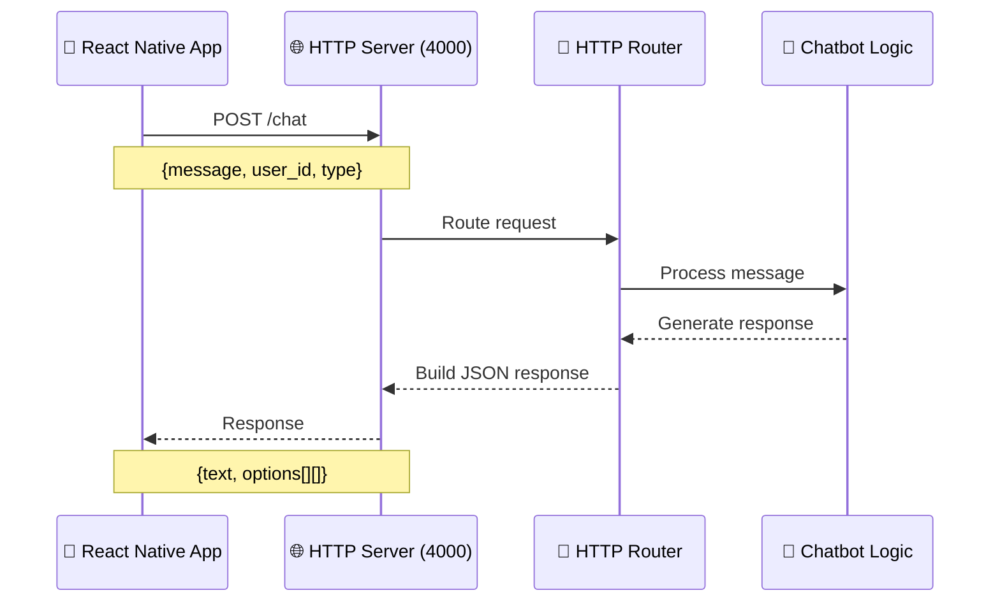
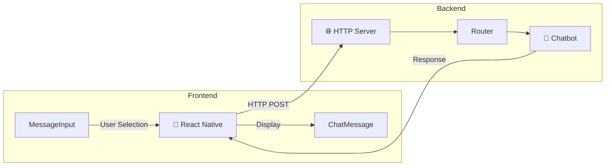

# 📝 Changelog - Ecos do Sur App

Todos los cambios notables en este proyecto serán documentados en este archivo.

El formato está basado en [Keep a Changelog](https://keepachangelog.com/es-ES/1.0.0/),
y este proyecto adhiere a [Semantic Versioning](https://semver.org/lang/es/).

---

## [Unreleased]

### 🎯 En progreso
- Integración del chatbot con la aplicación móvil

---

## [2025-12-01] - Conexión HTTP Chatbot ↔ React Native

Se ha conectado exitosamente el chatbot de Elixir con la aplicación React Native mediante HTTP. El backend expone un servidor HTTP en el puerto 4000 que recibe peticiones desde la app móvil.

### 🏗️ Arquitectura

```
React Native App (Frontend)
    ↓ HTTP POST
Backend Elixir (Puerto 4000)
    ↓
Chatbot Logic (Graphs)
    ↓ Response
React Native App
```

### 📊 Diagrama de Flujo





### 📁 Archivos Creados/Modificados

#### Backend (Elixir)

1. **`chatbot/mix.exs`** - Agregadas dependencias:
   - `plug_cowboy` - Servidor HTTP
   - `cors_plug` - Manejo de CORS

2. **`chatbot/lib/chatbot/http_router.ex`** - Router HTTP con endpoints:
   - `GET /health` - Health check
   - `POST /chat` - Endpoint principal para mensajes

3. **`chatbot/lib/chatbot/application.ex`** - Servidor HTTP agregado a supervisión

---

## [2025-11-28] - Configuración del Chatbot

### ✅ Añadido
- Integrado el chatbot como Git submodule desde el fork [2024-Ecos-do-Sur](https://github.com/diegobousop/2024-Ecos-do-Sur)
- Creado archivo `.gitmodules` para gestionar el submodule del chatbot
- Documentación inicial del proyecto

### 🔧 Configuración
- Configurado Git submodule en la carpeta `chatbot/`
- Establecida la estructura del proyecto con frontend (React Native) y backend (Chatbot Elixir)

### 📚 Documentación
- Actualizado README principal con información sobre la arquitectura del proyecto
- Creado este CHANGELOG para seguimiento de cambios

---

## Categorías de Cambios

Usa estas categorías para organizar tus cambios:

- **✅ Añadido** - Para nuevas funcionalidades
- **🔄 Cambiado** - Para cambios en funcionalidades existentes
- **⚠️ Deprecado** - Para funcionalidades que serán eliminadas pronto
- **❌ Eliminado** - Para funcionalidades eliminadas
- **🐛 Corregido** - Para corrección de bugs
- **🔒 Seguridad** - Para cambios relacionados con vulnerabilidades
- **🔧 Configuración** - Para cambios en configuración o dependencias
- **📚 Documentación** - Para cambios en documentación
- **🎨 Estilo/UI** - Para cambios visuales o de diseño
- **⚡ Rendimiento** - Para mejoras de rendimiento
- **🧪 Testing** - Para añadir o modificar tests

---

## Plantilla para nuevas entradas

```markdown
## [YYYY-MM-DD] - Título descriptivo

### ✅ Añadido
- Descripción del cambio

### 🔄 Cambiado
- Descripción del cambio

### 🐛 Corregido
- Descripción del bug corregido

### 📚 Notas
- Información adicional relevante
```

---

## Notas para el desarrollo

- Mantén este archivo actualizado con cada cambio significativo
- Usa fechas en formato ISO (YYYY-MM-DD)
- Sé descriptivo pero conciso
- Incluye referencias a issues o PRs cuando sea relevante
- Para tu TFG, esto servirá como evidencia de tu proceso de desarrollo
