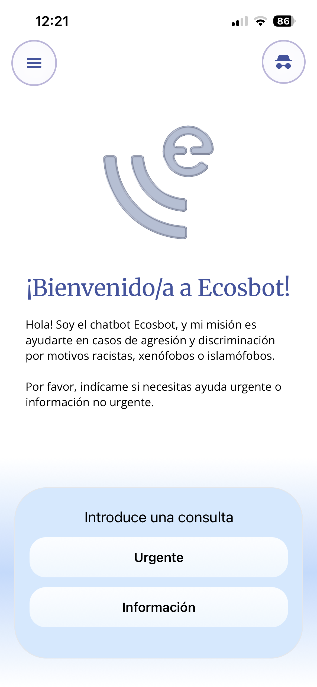
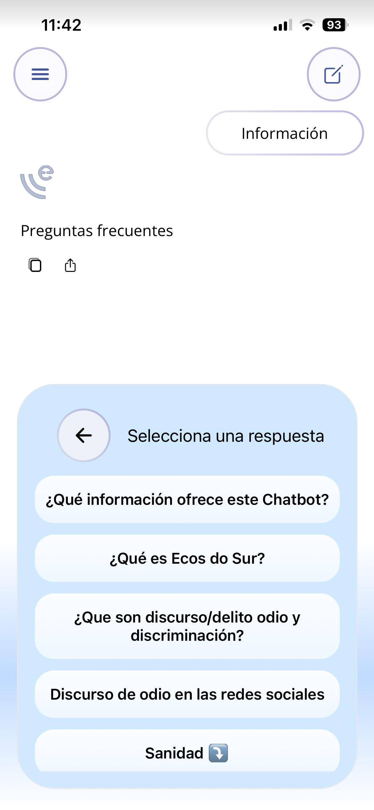
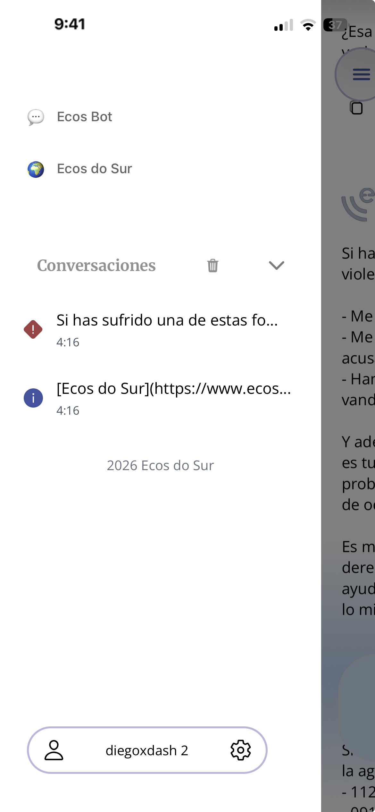
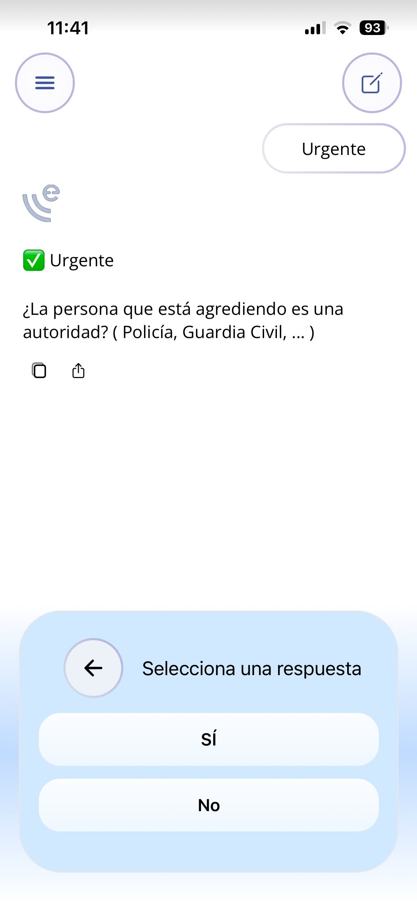
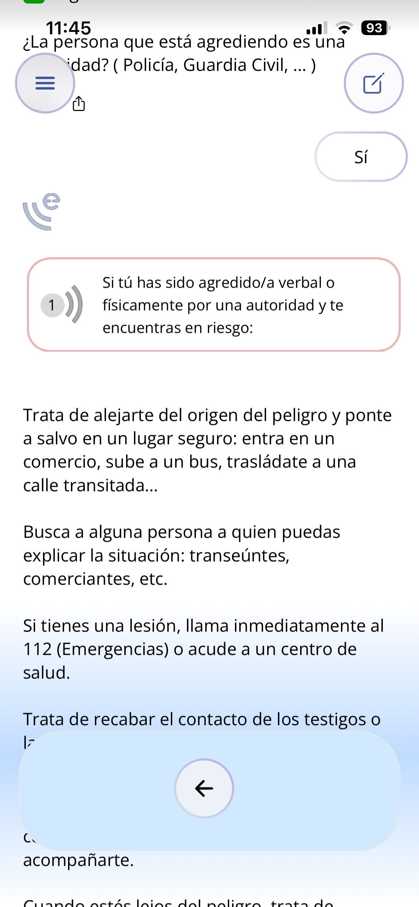
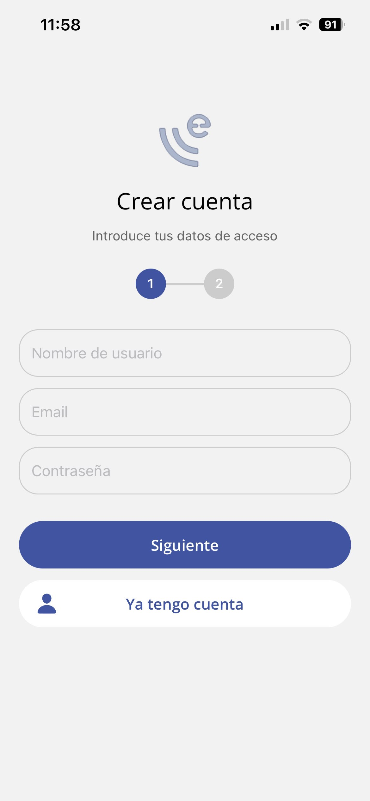
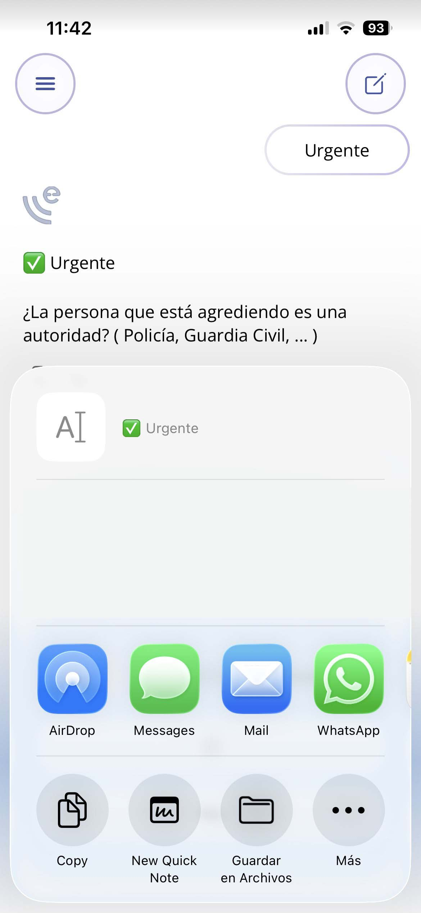
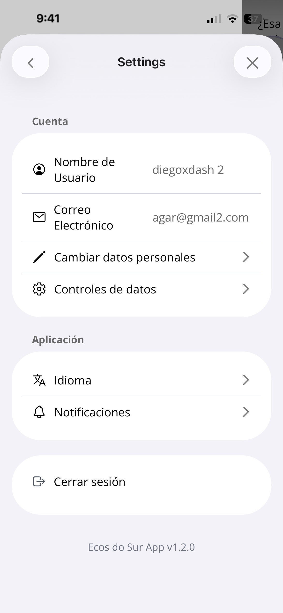
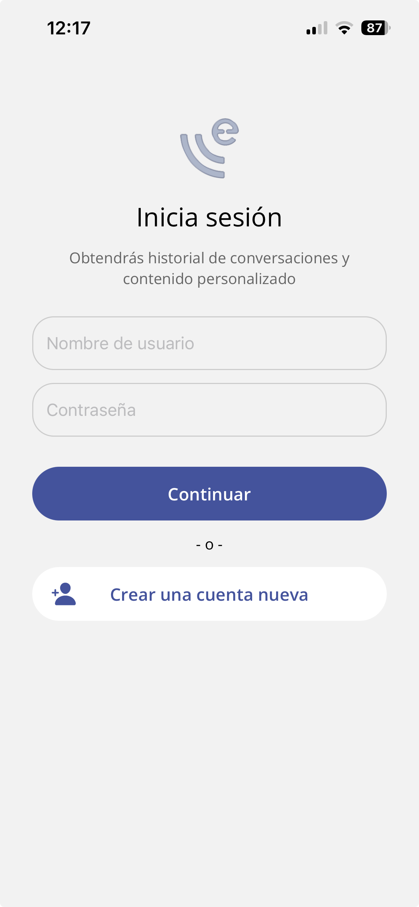

# 🌍 Ecos do Sur App


---

## 💻 Pantallas de mostra

<div align="center">
  <table>
    <tr>
      <td align="center">
        
      </td>
      <td align="center">
        
      </td>
      <td align="center">
        
      </td>
    </tr>
    <tr>
      <td align="center">
        
      </td>
      <td align="center">
        
      </td>
      <td align="center">
        
      </td>
    </tr>
    <tr>
      <td align="center">
        
      </td>
      <td align="center">
        
      </td>
      <td align="center">
        
      </td>
    </tr>
  </table>
</div>


## ✨ Motivación

### Sociais e éticas

- **Accesibilidade:**  
  É un dereito fundamental que asegura a igualdade de participación na nosa sociedade para as persoas en condicións adversas. Grazas ás novas tecnoloxías que se crean cada ano, conséguese cada vez solventar mellor os casos de violencia.

- **Empoderamento:**  
  A aplicación serve como canle segura e discreta para acceder a información, recursos e acompañamento.

### Tecnolóxicas

- **Integración de tecnoloxías abertas:**  
  O uso de ferramentas libres e multiplataforma (como Flutter, React Native ou similares) promove a independencia tecnolóxica e a colaboración comunitaria.

- **Reutilización e innovación tecnolóxica:**  
  A reutilización dun proxecto existente garante continuidade e aproveitamento de recursos, fomentando o desenvolvemento software sostible e solidario.

A organización Ecos do Sur previamente lanzou o seu asistente ante estas situacións, accesible mediante Telegram, describindo funcionalidades como:

- Axuda en situacións de urxencia
- Información de utilidade de varios campos:
  - Discurso de odio nas redes
  - Sanidade
  - Recursos por comunidade
  - Comercios

## 🎯 Obxectivos

- 💻 **Desenvolver unha aplicación accesible** dende Android e iOS cun chat manexado mediante pasos.
- 🔑 **Permitir rexistrar usuarios**, os cales poden gardar os seus datos persoais como historial de chats, idioma, preferencias e outros varios.
- 🌍 **Internacionalización da aplicación**, coa posibilidade de engadir máis idiomas nun futuro.
- 📱 **Asegurar un deseño responsivo, accesible e personalizable**.
- 📂 **Manter un código open-source** e mantido coas mellores prácticas.
- 🤝 **Colaborar con Ecos do Sur**, adaptando o proxecto aos seus intereses e visión.

## ⚙️ Tech Stack

- **Frontend:** React Native + Expo + TypeScript
- **Backend:** Maven e Spring Boot con base de datos H2 para desenvolvemento
- **Estilos** NativeWind (Tailwind para React Native)
- **Autenticación** Token jwt

---


## 🚀 Execución do proxecto


### 1) Instalar dependencias e iniciar a app (Expo)
```bash
cd app
npm install
npx expo start
```
### 2) Inicio do backend
```bash
mvn clean install
mvn spring-boot:run
```


Na saída, encontrarás varias opcións para abrir a app

- [compilación de desenvolvemento](https://docs.expo.dev/develop/development-builds/introduction/)
- [emulador de Android](https://docs.expo.dev/workflow/android-studio-emulator/)
- [simulador de iOS](https://docs.expo.dev/workflow/ios-simulator/)
- [Expo Go](https://expo.dev/go), un contorno limitado para probar o desenvolvemento de apps con Expo

## 📂 Versión 1.2.0


