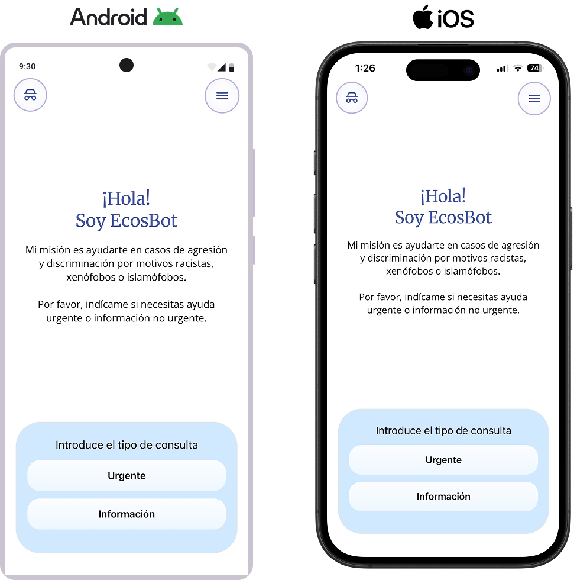
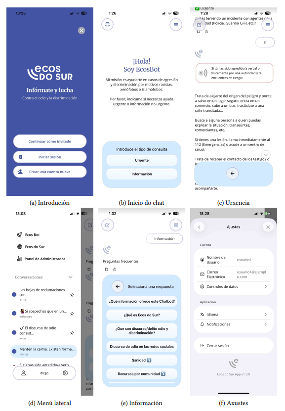

# 🌍 Ecos do Sur App

<div align="center">
  
**Aplicación móbil multiplataforma con
chatbot integrado destinada a persoas
potencialmente vítimas de discriminación,
agresións e violencias con base racista e
xenófoba.**

[](https://github.com)
[](https://reactnative.dev/)
[](https://elixir-lang.org/)
[](https://expo.dev/)
[](https://www.typescriptlang.org/)

</div>

---

## 📖 Sobre o proxecto

O racismo e a xenofobia en 2026 seguen sendo problemas críticos que afectan a toda a sociedade. Mentres os chatbots baseados en LLMs como ChatGPT ou Gemini gañan popularidade, a súa falta de control sobre a información pode resultar problemática en temas sensibles.

**Ecos do Sur** xurde como alternativa, utilizando árbores de decisión en lugar de redes neuronais para garantir información verificada e controlada. Esta aplicación móvil expande o chatbot existente en Telegram, fortalecendo a presenza dixital da ONG e ofrecendo unha ferramenta accesible, gratuíta e de código aberto contra o racismo e a xenofobia.

### 🌟 Características principais

- 🤖 **Chatbot inteligente** baseado en árbores de decisión con control total da información
- 🔐 **Sistema de autenticación** con JWT e xestión segura de usuarios
- 🌍 **Multilingüe** (Español, Galego, Inglés) con soporte para máis idiomas
- 📱 **Multiplataforma** (Android/iOS) con React Native + Expo
- 🎨 **Interfaz adaptable** con modo claro/oscuro e accesibilidade
- 📊 **Panel de administración** para xestión de usuarios e conversacións
- 💾 **Almacenamento de historial** de chats por categorías (urxente/información)
- 🆓 **Código aberto** e facilmente escalable

---


<div align="center">
  
  <br/><br/>
  
</div>


## ✨ Motivación

### 🤝 Sociais e éticas

- **Accesibilidade:**  
  É un dereito fundamental que asegura a igualdade de participación na nosa sociedade para as persoas en condicións adversas. Grazas ás novas tecnoloxías que se crean cada ano, conséguese cada vez solventar mellor os casos de violencia.

- **Empoderamento:**  
  A aplicación serve como canle segura e discreta para acceder a información, recursos e acompañamento ás víctimas de racismo e xenofobia.

- **Loita contra a desinformación:**  
  Fronte á proliferación de LLMs que poden transmitir información sesgada ou incorrecta, esta app garante información verificada e controlada pola ONG.

### 💻 Tecnolóxicas

- **Integración de tecnoloxías abertas:**  
  O uso de ferramentas libres e multiplataforma (React Native, Elixir, Expo) promove a independencia tecnolóxica e a colaboración comunitaria.

- **Reutilización e innovación tecnolóxica:**  
  A reutilización e expansión do chatbot existente de Telegram garante continuidade e aproveitamento de recursos, fomentando o desenvolvemento software sostible e solidario.

- **Escalabilidade e mantemento:**  
  Arquitectura moderna con backend en Elixir (alta concorrencia) e frontend en React Native (multiplataforma), permitindo crecemento futuro.

### 📋 Funcionalidades do chatbot

A organización Ecos do Sur previamente lanzou o seu asistente mediante Telegram. A nova aplicación expande estas funcionalidades:

- 🚨 **Axuda en situacións de urxencia** con información inmediata
- 📚 **Información de utilidade** en varios campos:
  - Discurso de odio nas redes sociais
  - Recursos de sanidade
  - Información por comunidade autónoma
  - Directorio de comercios e servizos
- 💬 **Historial de conversacións** gardado por categorías
- 👤 **Perfil de usuario** personalizable
- 🌐 **Cambio de idioma** en tempo real

## 🎯 Obxectivos

- 💻 **Desenvolver unha aplicación accesible** dende Android e iOS cun chat manexado mediante pasos baseados en árbores de decisión
- 🔑 **Permitir rexistrar usuarios** que poden gardar os seus datos persoais como historial de chats, idioma, preferencias e outros
- 🌍 **Internacionalización da aplicación** con soporte para Español, Galego e Inglés, coa posibilidade de engadir máis idiomas nun futuro
- 📱 **Asegurar un deseño responsivo, accesible e personalizable** con modo claro/oscuro
- 🛡️ **Implementar autenticación segura** con tokens JWT e protección de endpoints
- 📊 **Crear un panel de administración** para xestión de usuarios e análise de conversacións
- 📂 **Manter un código open-source** seguindo as mellores prácticas e con cobertura de tests
- 🤝 **Colaborar con Ecos do Sur**, adaptando o proxecto aos seus intereses e visión para fortalecer a súa presenza dixital

---

## ⚙️ Tech Stack

### Frontend
- **React Native** - Framework multiplataforma
- **Expo** - Plataforma de desenvolvemento
- **TypeScript** - Tipado estático
- **NativeWind** - Tailwind CSS para React Native
- **Expo Router** - Navegación baseada en ficheiros
- **React Context** - Xestión de estado global
- **Expo SecureStore** - Almacenamento seguro de datos

### Backend
- **Elixir** - Linguaxe de programación funcional
- **Plug** - Composición de módulos web
- **CouchDB** - Base de datos NoSQL
- **JWT (Joken)** - Autenticación con tokens
- **Poison** - Serialización JSON
- **ExUnit** - Framework de testing

### Arquitectura
- **Cliente-Servidor** con API REST
- **Sistema de cola (Buffer)** para procesamento asíncrono de mensaxes
- **Persistencia dual** (usuarios e conversacións) con GenServer
- **Árbores de decisión** para lóxica do chatbot

---


## 🚀 Execución do proxecto

### Requisitos previos
- Node.js (v18 ou superior)
- Elixir (v1.16 ou superior)
- Erlang/OTP (v26 ou superior)
- CouchDB (v3.3 ou superior)
- Expo CLI (`npm install -g expo-cli`)

### 1️⃣ Configuración do Backend (Elixir)

```bash
cd chatbot
mix deps.get
mix compile
```

Configura as variables de entorno en `config/dev.exs` ou crea un ficheiro `.env`:

```elixir
# Database
config :chatbot, :couchdb_url, "http://localhost:5984"

# JWT Secret
config :chatbot, :jwt_secret, "your-secret-key-here"
```

Inicia o servidor:

```bash
mix run --no-halt
# ou en modo interactivo
iex -S mix
```

O backend estará dispoñible en `http://localhost:4000`

### 2️⃣ Configuración do Frontend (React Native + Expo)

```bash
cd frontend
npm install
```

Configura a URL do backend en `utils/apiConfig.ts`:

```typescript
const API_BASE_URL = 'http://localhost:4000/api';
```

Inicia a aplicación:

```bash
npx expo start
```

Na saída, encontrarás varias opcións para abrir a app:
- Premer `a` para abrir no emulador de Android
- Premer `i` para abrir no simulador de iOS  
- Escanear o código QR con Expo Go (Android/iOS)

### 3️⃣ Execución de tests

**Backend (Elixir):**
```bash
cd chatbot
mix test                    # Todos os tests
mix test test/http_user_test.exs  # Tests específicos
```

**Frontend (React Native):**
```bash
cd frontend
npm test                    # Tests unitarios
npm run test:coverage      # Con cobertura
```

---

## 🛠️ Ferramentas de desenvolvedor

### Deployment

#### Android

- Build local (rápido, sin cuenta EAS)   
cd frontend
npx expo run:android --variant release

- EAS Build (en la nube)
Instalar EAS CLI si no lo tienes
npm install -g eas-cli

Login en Expo
eas login

Crear build de desarrollo para android: Crear APK (no AAB)

eas build --platform android --profile development

eas build -p android --profile preview

### Depuración e desenvolvemento

- **[Compilación de desenvolvemento](https://docs.expo.dev/develop/development-builds/introduction/)** - Builds personalizadas para depuración
- **[Emulador de Android](https://docs.expo.dev/workflow/android-studio-emulator/)** - Android Studio
- **[Simulador de iOS](https://docs.expo.dev/workflow/ios-simulator/)** - Xcode (só macOS)
- **[Expo Go](https://expo.dev/go)** - App de Expo para probas rápidas

### Ferramentas útiles

- **React DevTools** - Depuración de compoñentes
- **Expo DevTools** - Inspección de logs e estado
- **Observer** - Monitorización de procesos Elixir (`:observer.start()`)
- **ExUnit** - Tests automatizados en Elixir

---

## 📁 Estrutura do proxecto

```
ecos-do-sur-app/
├── frontend/                    # Aplicación React Native
│   ├── app/                    # Rutas e pantallas (Expo Router)
│   │   ├── (tabs)/            # Pestanas principais
│   │   ├── index.tsx          # Pantalla inicial
│   │   ├── login.tsx          # Login
│   │   └── register.tsx       # Rexistro
│   ├── components/            # Compoñentes reutilizables
│   │   ├── chat/             # Compoñentes de chat
│   │   ├── admin/            # Panel de administración
│   │   └── common/           # Compoñentes comúns
│   ├── contexts/             # Contextos de React (Auth, Chat)
│   ├── utils/                # Utilidades e servizos
│   └── constants/            # Constantes e configuración
│
├── chatbot/                    # Backend en Elixir
│   ├── lib/
│   │   ├── chatbot/          # Lóxica do chatbot
│   │   ├── http/             # Controladores HTTP
│   │   │   ├── router.ex    # Rutas da API
│   │   │   ├── user_controller.ex
│   │   │   └── chat_controller.ex
│   │   └── user/             # Xestión de usuarios
│   ├── test/                 # Tests automatizados
│   ├── config/               # Configuración
│   └── mix.exs               # Dependencias
│
└── assets/                     # Recursos estáticos
    └── readme/                # Imaxes do README
```

---

## 🔒 Seguridade

- ✅ Autenticación con JWT (tokens con expiración)
- ✅ Almacenamento seguro con Expo SecureStore
- ✅ Validación de datos no backend
- ✅ Protección contra inyección SQL/NoSQL
- ✅ Control de acceso baseado en roles (user/admin)
- ✅ Hash seguro de contrasinais
- ✅ Verificación de duplicados en rexistro

---

## 🧪 Cobertura de tests

O proxecto inclúe tests completos para garantir a calidade do código:

### Backend (Elixir/ExUnit)
- ✅ Tests de integración HTTP (users, chat, callbacks)
- ✅ Tests de autenticación e autorización
- ✅ Tests de validación de datos
- ✅ Tests de páxinación e filtrado
- ✅ Tests de casos límite e erros

### Frontend (Jest/React Testing Library)
- ✅ Tests de compoñentes
- ✅ Tests de navegación
- ✅ Tests de integración con API

Executar tests:
```bash
# Backend
cd chatbot && mix test

# Frontend  
cd frontend && npm test
```

---

## 📊 API Endpoints

### Autenticación
- `POST /api/signUp` - Rexistro de usuario
- `POST /api/login` - Inicio de sesión
- `GET /api/me` - Información do usuario autenticado (protexido)

### Chat
- `POST /api/chat` - Enviar mensaxe ao chatbot
- `POST /api/callback` - Procesar callback de opcións
- `POST /api/chat/save` - Gardar metadata de chat (protexido)

### Usuarios (Admin)
- `GET /api/users` - Listar usuarios con páxinación (admin)
- `POST /api/check-user` - Verificar existencia de usuario
- `POST /api/update-username` - Actualizar nome de usuario


---

## 🌐 Internacionalización

A aplicación soporta múltiples idiomas:

- 🇪🇸 **Español** (es)
- 🇬🇧 **Inglés** (en)  
- 🏴󐁧󐁢󐁥󐁳󐁿 **Galego** (gl/gal)

Os usuarios poden cambiar o idioma dende a configuración da app. As traducións están en `frontend/app/i18n/`.

---

## 📄 Licenza

Este proxecto é de código aberto e está dispoñible baixo a licenza MIT.

---

## 🤝 Contribucións

As contribucións son benvidas! Para contribuír:

1. Fai un fork do proxecto
2. Crea unha rama para a túa funcionalidade (`git checkout -b feature/NovaFuncionalidade`)
3. Fai commit dos teus cambios (`git commit -m 'Engadir nova funcionalidade'`)
4. Sube a rama (`git push origin feature/NovaFuncionalidade`)
5. Abre un Pull Request

---

## 👥 Autores

Desenvolvido en colaboración con **Ecos do Sur** como parte dun Traballo de Fin de Grao.

---

## 📞 Contacto

Para máis información sobre o proxecto ou Ecos do Sur, visita [ecosdosur.org](https://ecosdosur.org)

---

## 📂 Versión 1.2.0

### Novidades
- ✨ Implementación completa do backend en Elixir
- 🔐 Sistema de autenticación con JWT
- 📊 Panel de administración
- 🌍 Soporte multilingüe completo
- 💾 Persistencia de conversacións
- 🧪 Cobertura completa de tests
- 📱 Melloras na UX e accesibilidade


